# Inter-Nord-tracking

## Overview
This project aimed at tracking the real-time movements of the vessel Inter Nord on the Norwegian coast and sea areas. The data was well visualised on a power BI dashboard. The dashboard also showed the vessel's fuel and lube oil consumption throughout the year.

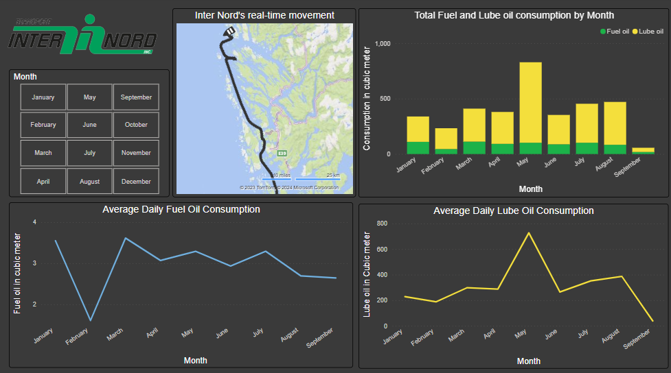

## Data
The data for the dashboard came from two sources, an Excel file and BarentsWatch API. The Excel file contained the vessel's fuel and lube oil consumption data for the vessel which was manually updated daily. The second source, [BarentsWatch](https://www.barentswatch.no/), is a Norwegian digital platform providing access to various data and information related to the Norwegian coast and sea areas. BarentsWatch API provided the data for the realtime coordinates, speed, and direction of the vessel, as well as the past 24 hours data.

### Fuel and Lube Oil Data
As stated earlier, the fuel and lube oil consumption data was in an Excel file and was manualy updated daily. This is the template format of the data for each month.   
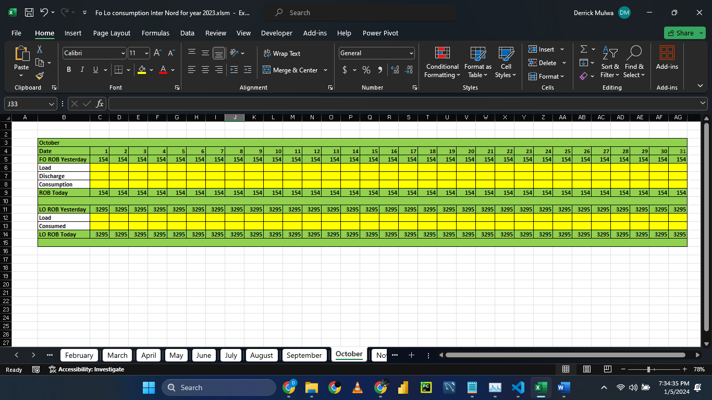     

Each month has its data in its own tab, from January to December.  
Row number 4 [Date] contains the day of the month.   
Row number 5 [FO ROB Yesterday] contains the cumulative remaining fuel oil at the start of each day.  
Row number 6 [Load] will be manually entered if new fuel oil is added into the ship (refueling)  
Row number 7 [Discharge] will be entered manually if some fuel is removed.  
Row number 8 [Consumption] will be entered manually for the used fuel on that day    
Row number 9 [ROB Today] represents the fuel oil remaining at the end of the day after deducting the consumed and discharged oil, and adding the Loaded volume.  
Row number 11 [LO ROB Today] represents the volume of lube oil present on the start of the day.  
Row number 12 [Load] will be entered manually if lube oil is refueled/added. 
Row number 11 [Consumed] represents the volume of lube oil used up on that day.  
Row number 9 [LO ROB Today] represents the volume of lube oil remaining at the end of that day.    

This is a sample of a filled month  
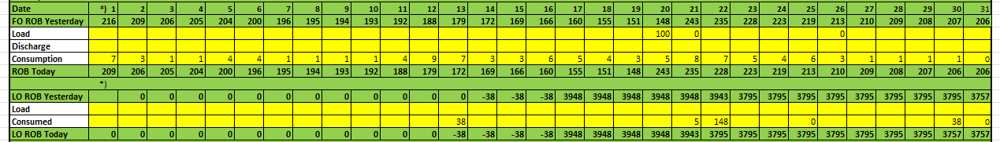     

I loaded the excel data into Power BI using a python script. 
 
 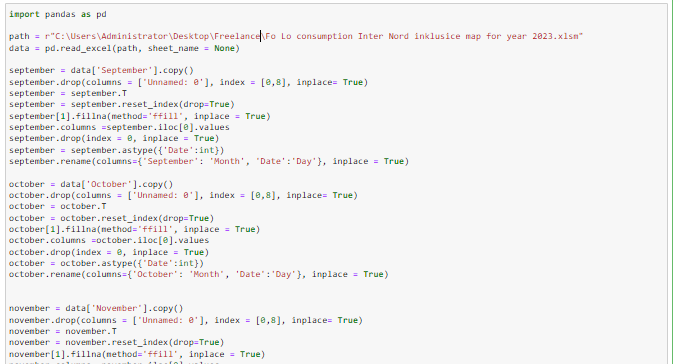     
I read the excel file using python, and for each month, I:
+ Dropped blank columns
+ Transposed the data
+ Filled blank rows with appropriate data, using the ffil(foward fill) method for this scenario
+ Renamed the columns
+ Dropped blank/unwanted rows to ensure data integrity,consistency and accuracy
+ Changed datatypes for the date columns to the appropriate date data type

After data for each month was cleaned and formatted accordingly, I concatenated all the months data to form one large table for the year.     
 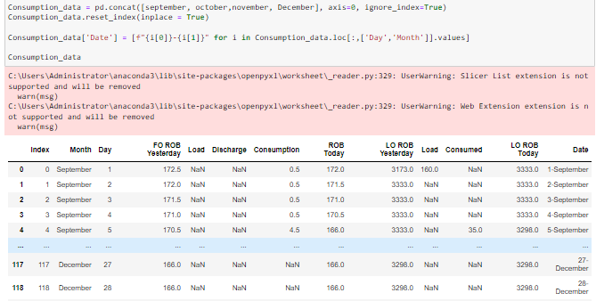     

I imported this well formated data using the 'Python script' source in Power BI. This data was used to create all the Fuel and Lube oil visuals  
### BarentsWatch API Data
BarentsWatch is a Norwegian governmental portal providing access to various maritime data and information. Their NAIS service shows all vessels in Norwegian waters, apart from fishing vessels under 15 meters and recreational vessels under 45 meters. I used their API to get the last 24 hours location and speed of the vessel Inter Nord.
   
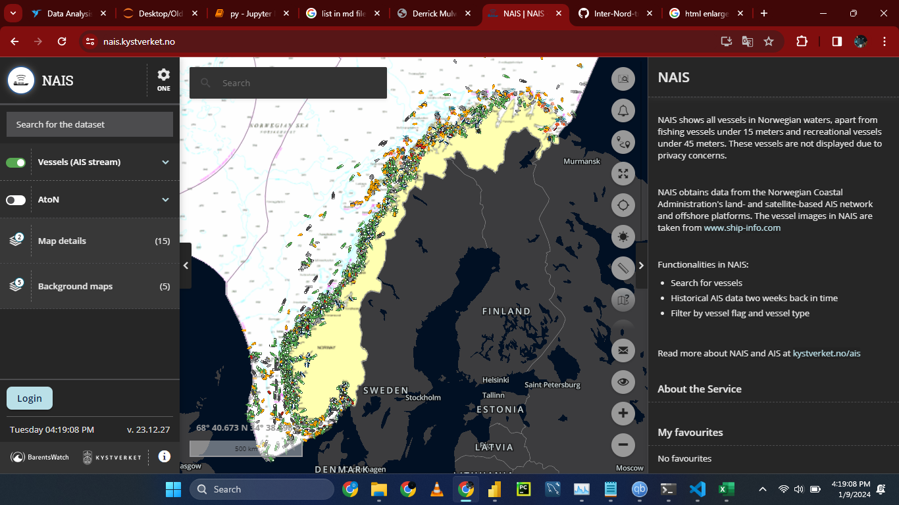     

To get the data using the API, one has to go through two steps as detailed [here](https://developer.barentswatch.no/docs/AIS/live-ais-api), 

1. Get an access token using user's credentials.
2. Use the generated access token to get the data. 

 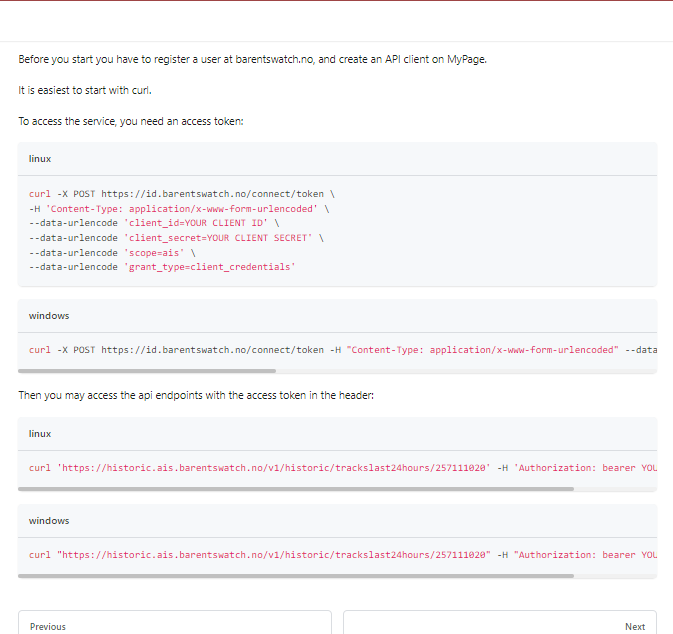     

However, the access token is valid for only 1 hour. This made it impossible to directly import the data into Power BI using the 'Web' data source because the method wouldn't work after an hour, the token would have expired. I had to use python to achieve this.

  
First, I imported the required libraries:
- requests: To send http requests to the AIS API and get the access  and  data
- pandas : Clean,transform and manipulate the data from the API
- json : Handle the response from the API which is in the JSON format
- math : Do some math calculations to get distance between two coordinates, etc.

 I requested an access token using the requests module and editing the Request headers and data appropriately   
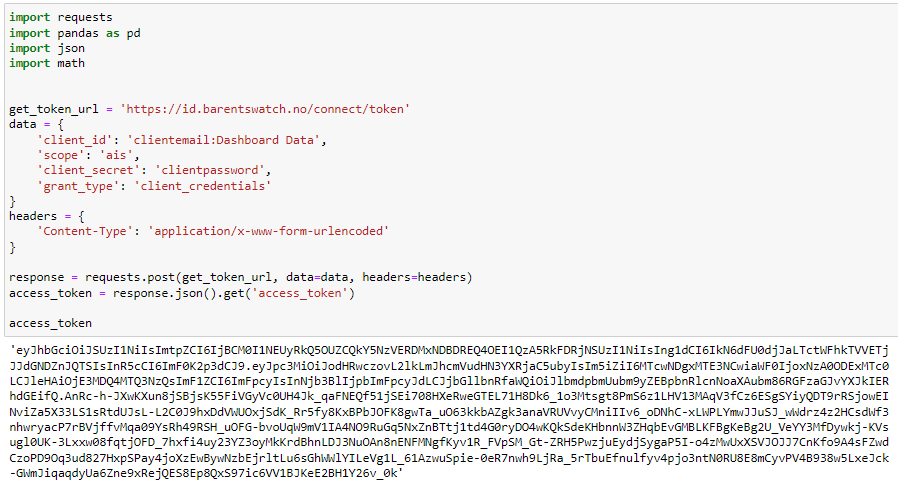     

I then used the generated token to request for the data   
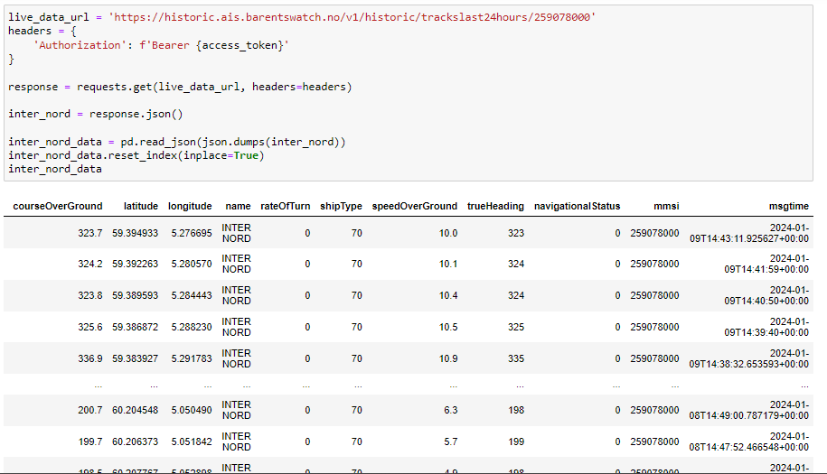     

I used the coordinates(Latitude and longitude) to compute the cumulative distance covered by the vessel over time. This is where the math module came in handy   
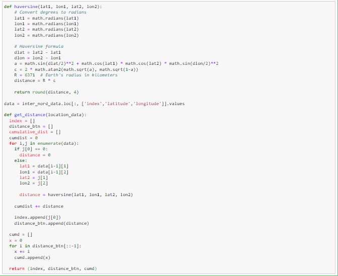     

I then added the distance columns to the dataframe table   
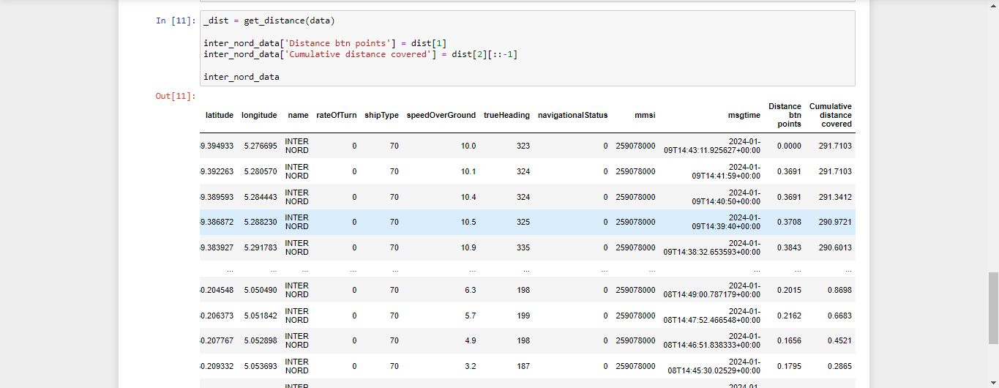     
Getting data from the API using this method was a success since the data would be refreshed uncountable times without an issue, since an acess token was freshly generated on each refresh.

  I then imported this data into Power BI and was ready for the next step, creating the visualizations.   
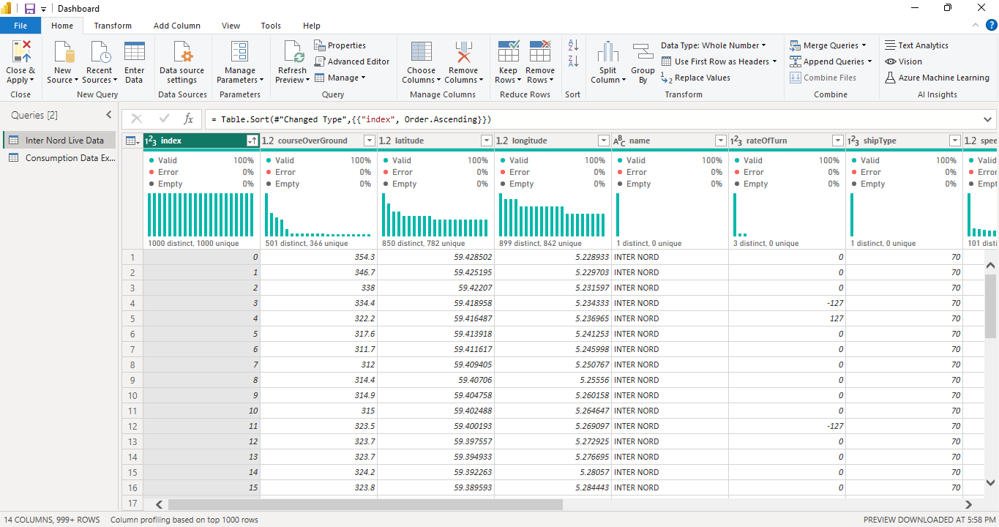     

## Dashboard creation in Power BI
I first created the fuel consumption visuals which include:
### Total fuel and lube oil consumption by month.
I created a stacked column chart to show the total monthly fuel and lube oil consumption.   
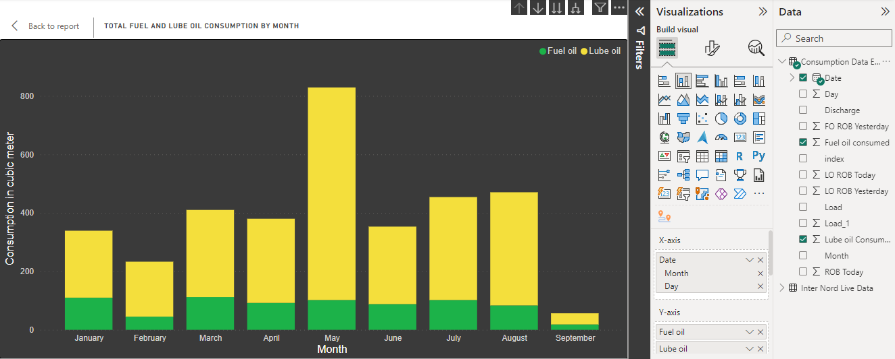     

### Average Daily Fuel Oil Consumption.
I created a line chart to show the average monthly fuel oil consumption.   
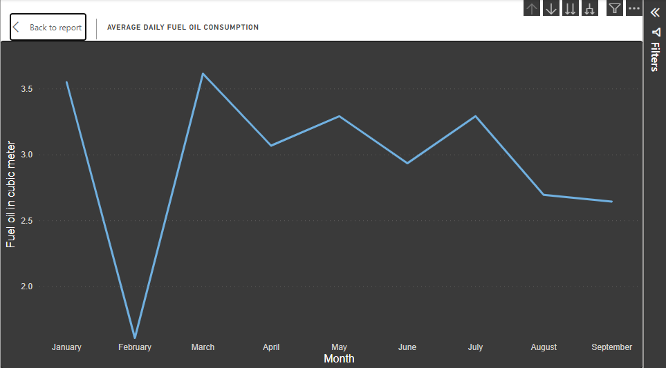     

### Average Daily Lube Oil Consumption.
I created a line chart to show the average monthly lube oil consumption.   
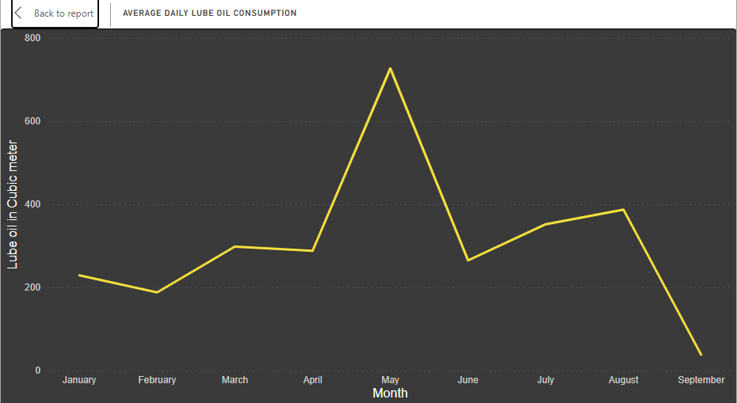    

### Inter-Nord's real time movement.
I downloaded the Route map visual to clearly show the movements. 
The tooltip showed the time and speed when the vessel was at that position. The route showed the direction theshipwas moving towards 
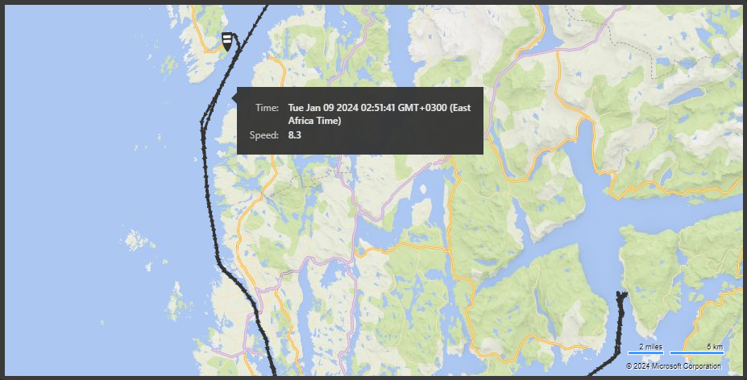     

## Conclusion
This project was exciting, educating, and strengthened my knowledge and expertise in Power BI and using APIs in Python.
